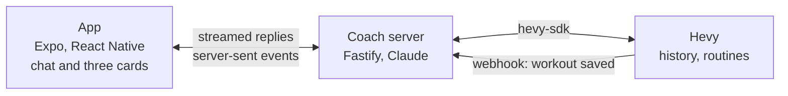

# Coach for Hevy

An AI coach built on the [Hevy](https://hevyapp.com) public API. You keep logging in Hevy. The coach reads your whole history, writes your next training block into Hevy as routines, reviews every workout the moment you save it, and answers training questions in a chat.



## How it works

- **Intake in the chat.** Pills for goals, injuries and bodyweight, one open question. The history already answers the rest.
- **Plan in two steps.** The coach streams its read of you within seconds, then writes the block as JSON. A guard bounds every load, rep and set before the routines are written into a "Coach" folder in Hevy.
- **Review on the webhook.** Save a workout in Hevy and the coach fetches it, posts "Workout logged", then a verdict with one question and, when warranted, a proposed change you accept with one tap. Nothing changes in Hevy without that tap.
- **Live thread.** The server announces every change on an event stream and the app updates in place. A push covers a closed app.
- **The app stores nothing.** One JSON state file on the server holds the profile, the block, the thread and the coach's memory.

## Built on

- [`hevy-sdk`](https://www.npmjs.com/package/hevy-sdk): typed client for the Hevy public API, generated from the live OpenAPI document and corrected against the live API.
- [`hevy-coach`](https://www.npmjs.com/package/hevy-coach): MCP server with 26 coaching tools for Claude, ChatGPT and Gemini.

Both published from [furkantanyol/hevy-coach](https://github.com/furkantanyol/hevy-coach).

## Run

```sh
pnpm install
pnpm validate                 # lint, typecheck, 388 server tests
pnpm --filter server dev      # Fastify on :3001, needs server/.env
pnpm start                    # Metro for the dev client
```

## Layout

```
src/        the app: one screen, the assistant-ui thread, the cards
server/     the coach: routes, intake, plan, guard, review, Hevy, state
docs/       spec.md, adr/, hevy-webhook-delivery.md
```
